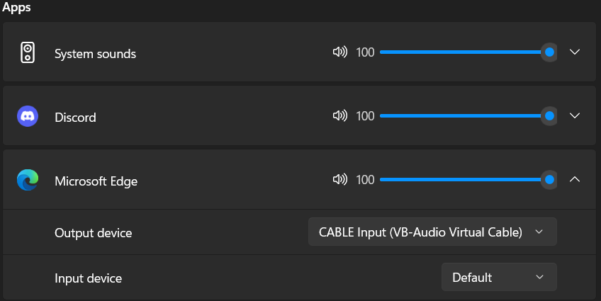
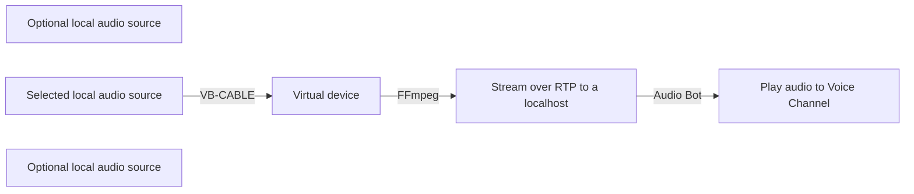

# Discord.js FFmpeg Audio Stream Bot

### A fully functional discord bot, that streams your local audio of preference into a voice channel

The main goal of this project is to tackle the problem of streaming audio sources from various online music-services, into a Discord voice channel, via a bot. Instead of streaming directly from these services, you can now choose the local audio source of your preference and stream it live into the voice channel you are, in your Discord Server.

---

## How to execute this project

The necessary steps to fully run this project are the following:

- Get VB-CABLE Virtual Audio Device (download [here](https://vb-audio.com/Cable/))
- Get FFmpeg (download [here](https://ffmpeg.org/download.html))
- Create a discord bot through the [Discord Developer Portal — My Applications](https://discord.com/developers/applications)
- Clone this repository on your computer
- Have Node.js & NPM installed

> **Note:** Project has been built on a Windows 11 pc, using Node.js v18.17.1 and NPM v9.6.7
> 
> **Note:** I have not yet included tutorials for the installations of FFmpeg & VB-CABLE, as well as creating a Discord bot from their developer portal. You can find plenty of related sources about them on the internet.
> 
> > **Important:** You will need to add FFmpeg to path for this project to work!

Let's check each aforementioned program individually and why it's needed.

### 1.  VB-CABLE Virtual Audio Device
This program creates two new virtual audio devices (for input and output). What we want to achieve by that, is to assign the audio source (or sources) of your choice, to the virtual device that has been created. This device is going to be targeted later on by the FFmpeg.

For example, I'm playing some music from my browser - I will open the system's volume mixer and i will reassign its default audio device to the virtual one, as shown in the picture below:

### 2. FFmpeg
The FFmpeg program has a lot of utilities in general. We are only targeting its ability to capture the audio source, from a specific audio device, and stream it over RTP (Real-time Transport Protocol) to a localhost address. This RTP source will be used later on from our Discord bot to stream your audio into a desired voice channel.

Once you have FFmpeg installed and added to path, you will have to run the following command line:

**ffmpeg -f dshow -i audio="ENTER VIRTUAL AUDIO DEVICE NAME HERE" -acodec libmp3lame -ab 128k -f rtp rtp://127.0.0.1:1234**

- `-f dshow`: Specifies the input format as  **DirectShow**, which is a multimedia framework used on Windows for capturing and processing audio and video.
    
- `-i audio="ENTER VIRTUAL AUDIO DEVICE NAME HERE"`: This part of the command specifies the input source. Essentially, it routes audio from one application to another within your system.
    
    > **Tip:** It's essential to add the exact name of the virtual audio device. For that, you can use the following command:
     **ffmpeg -list_devices true -f dshow -i dummy**
     and copy the correct device name

- `-acodec libmp3lame`: Sets the audio codec to  **libmp3lame**, which is the LAME MP3 encoder. It will encode the audio data into MP3 format.
    
-  `-ab 128k`: Specifies the audio bitrate for the output MP3 file. In this case, it’s set to  **128 kbps** (kilobits per second). Remember that the choice of bitrate depends on your desired audio quality, file size constraints, and compatibility with playback devices. Adjust the parameters based on your specific needs!
    
-  `-f rtp rtp://127.0.0.1:1234`: This part of the command specifies the output format as  **RTP (Real-Time Transport Protocol)**. RTP is commonly used for streaming audio and video over networks. The destination address is  **127.0.0.1**  (localhost) on port  **1234**. You can assign whatever address you want, although I'd suggest you don't. If you do, you will also have to edit, accordingly, the ***join.js*** file, inside the commands folder of our repository.

If everything goes right so far, you will be having your prefered audio source streaming from a virtual device, to a localhost address, that our Discord bot will use later on. The roadmap of our audio source will be looking kinda like this:

### 3. Discord Developer Portal & Repository app

When you create your bot-application through the Discord's developer portal, you will be given a *ClientID* and a *Token*. Remember to write down the *Token* - it's being given to you only once, at the moment you created it (it shows up only the moment it's created - you can't retrieve it later on and you will be forced to create a new one if you forget it)
>**Important:** Inside the OAuth2 selection of your application, you will generate an invite link to add the bot to your server. 
> - For "SCOPES" choose "bot" and "applications.commands"
> - For "BOT PERMISSIONS" choose "Messages/View Channels", "Use Slash Commands", "Connect" & "Speak"

Continuing on, once you have cloned the repository, enter the corresponding directory and use ***npm install*** to add all the necessary dependencies. Afterwards, you will have to create an ***.env*** file at the root directory of this project. Its format will have to look like this:
##### CLIENTID = 9999999999999999999
##### SERVERID = 9999999999999999999
##### TOKEN = "Your bot token"

Two last steps are remaining! 
Firstly, for one time only, once you have invited the bot to your Discord server, run ***node deploy-commands.js***. This way, we register our included slash commands to Discord.
Lastly, run ***node bot.js*** and you are ready to go! The bot should appear as online within the server's members and you can execute its commands from any text-input within the Discord app's server. The 2 commands we can execute are ***/join*** and ***/exit***

> **Note:** If you cannot see the bot online after all this, remember to check for dedicated server & channel permissions that may come into conflict.
